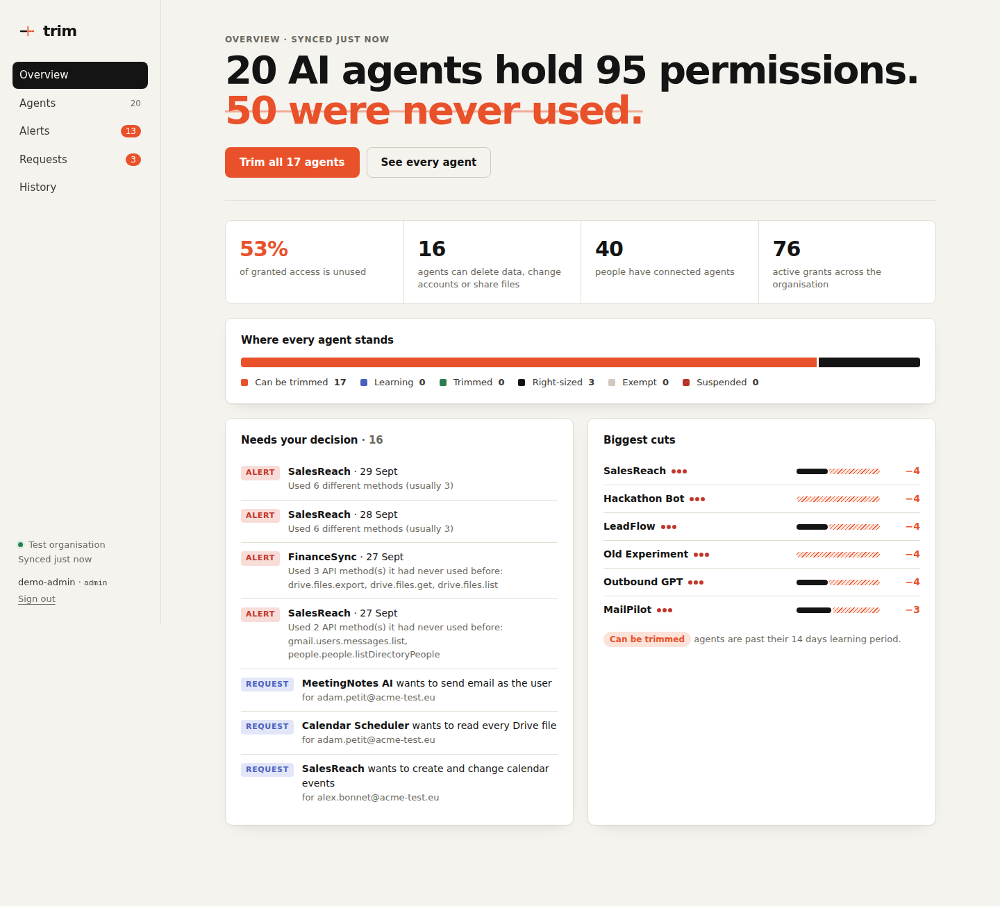

# Trim

**Every AI agent gets the keys it actually uses, and nothing more.**

Companies connect AI agents to email, files, calendars and code, usually with far more access than the task needs. Discovery tools can list those agents; nobody can review thousands of them by hand. Trim watches what each agent really does, removes the permissions it never used, flags agents that start behaving unlike themselves, and lets an administrator approve or undo every change in one click.

ESAIP MSc Technical Project · Networks (Cyber Security) with Development and Data Management components.



## What it does

| | |
|---|---|
| **Inventory** | Every AI app and agent holding access to the organisation, its owner, and one plain sentence describing its reach ("Can read, send and permanently delete all email, for 6 people"). |
| **Least privilege** | After a 14-day observation window, Trim computes the smallest set of permissions that covers everything the agent did, and recommends removing or **narrowing** the rest (e.g. `mail.google.com` → `gmail.readonly` + `gmail.send`). Every kept permission carries its justification: the API methods that needed it. |
| **One-click trim and undo** | Changes go through the provider's API, atomically. The exact previous state is stored, so undo restores it byte for byte. |
| **Anomaly detection** | Each agent is compared with its own baseline. An Isolation Forest scores daily behaviour; an alert also needs a concrete reason ("Used 3 API methods it had never used before: drive.files.export…"). Days with open alerts never justify keeping a permission. |
| **Permission requests** | New access is answered like a phone permission prompt: *Allow once* (auto-revoked when the window ends), *Allow always*, *Deny*. |
| **Plain questions** | "Which agents can *permanently delete email*?" is a filter on the Agents page. |

## Results on simulated organisations

Measured with `trim evaluate --seeds 1 2 3 4 5` (5 organisations, 20 agents and 40 users each, 12 injected incidents each; full output in [`docs/evaluation.json`](docs/evaluation.json)):

| Model | Precision | Recall | F1 |
|---|---|---|---|
| Unused-permission removal (996 removable permissions) | **1.000** | 0.988 | 0.994 |
| Anomaly detection (agent-days) | **0.935** | 0.800 | 0.862 |

Anomaly recall by attack: exfiltration 15/15, goal hijack 15/15, off-hours activity 13/15, **slow permission creep 29/45**. Slow creep is the hard case: its first day looks almost normal. That is an honest limit of a per-day model and a good direction for future work (sequence models over several days).

## Architecture

```
 Google Workspace / M365 / simulator
          │  read-only admin APIs                ┌──────────────┐
          ▼                                      │  Dashboard   │ React + TypeScript
   ┌─────────────┐   ┌────────────┐   ┌───────┐  │  (nginx)     │
   │  Connector  │──▶│  Sync      │──▶│  DB   │◀─┤  /api proxy  │
   └─────────────┘   └────────────┘   └───────┘  └──────┬───────┘
          ▲                              │              │ Bearer token
          │ revoke / narrow / restore    ▼              ▼
   ┌─────────────┐   ┌──────────────────────────────────────────┐
   │ Remediation │◀──│ FastAPI: recommender · anomaly · requests  │
   └─────────────┘   └──────────────────────────────────────────┘
```

* **Backend** (`backend/trim`): Python 3.11+, FastAPI, SQLAlchemy 2, Alembic, scikit-learn.
  * `scopes.py`: the permission catalog and the minimal-cover algorithm (the explainable core).
  * `connectors/`: `google.py` (Admin SDK Directory + Reports APIs, retries with backoff) and `simulated.py`. All of them share one contract with honest `Capabilities`.
  * `services/`: sync, recommender, remediation (atomic, compensating), requests, anomaly, pipeline, notifications.
  * `simulator.py` and `evaluate.py`: a labelled synthetic organisation and the metrics.
* **Frontend** (`frontend/`): React 18 + TypeScript + Vite, no UI framework, light and dark themes, works on a phone.
* **Infra**: Docker Compose (Postgres, migrations, API, worker, nginx), GitHub Actions CI.

## Quick start (local, test organisation)

```bash
# Backend
cd backend
pip install -e ".[dev]"
trim token create --name you --role admin      # prints a token and a config entry
export TRIM_API_TOKENS='<the printed entry>'
trim simulate                                  # builds a 40-person test org with 20 agents
trim serve                                     # API on http://127.0.0.1:8000 (docs at /api/docs)

# Frontend (second terminal)
cd frontend
npm install
npm run dev                                    # http://localhost:5173, sign in with the token
```

## Run with Docker

```bash
cp .env.example .env          # fill POSTGRES_PASSWORD, TRIM_API_TOKENS, TRIM_ENCRYPTION_KEY
docker compose up --build -d
docker compose run --rm api trim simulate     # load the test organisation
open http://localhost:8080
```

## Connecting a real Google Workspace test tenant

1. In Google Cloud, create a service account with **domain-wide delegation**.
2. In the Admin console, authorise it for exactly three scopes:
   * `admin.directory.user.readonly`
   * `admin.directory.user.security`
   * `admin.reports.audit.readonly`
3. Store the key encrypted, then delete the file:
   ```bash
   trim key create                                   # -> TRIM_ENCRYPTION_KEY
   trim connect google --credentials sa-key.json
   ```
4. Set `TRIM_CONNECTOR=google` and `TRIM_GOOGLE_ADMIN_EMAIL=admin@your-test-domain`.

Two provider facts shape the product:
* **Plan level.** Per-call OAuth activity events exist only on Enterprise Standard/Plus, Education Standard/Plus and Cloud Identity Premium.
* **No in-place narrowing.** Google can revoke a token but cannot narrow or recreate one. On Google, a trim therefore becomes a confirmed revocation (the owner reconnects with fewer permissions) and automatic undo is unavailable. The UI and API say so explicitly.

## Security

* **Authentication.** Bearer tokens with three roles: admin, reviewer (read-only, reviews alerts) and service (submits requests only). Only SHA-256 hashes are configured, and comparison is constant-time.
* **Secrets.**
  * Provider credentials are encrypted at rest with Fernet.
  * No secrets live in source; CI runs gitleaks.
  * The dashboard keeps its token in `sessionStorage`, so it is per tab and never shared.
* **Input handling.**
  * Every input is validated by strict Pydantic models (`extra="forbid"`, patterns, lengths).
  * Validation errors never echo submitted values.
  * Bodies are capped at 64 KB.
  * All queries go through the ORM; there is no string-built SQL.
* **HTTP hardening.**
  * The API sends CSP `default-src 'none'`, `nosniff`, `DENY` framing and `no-store`.
  * nginx serves a strict CSP and HSTS, and rate-limits the API.
  * The docs endpoints are disabled in production.
* **Data minimisation (GDPR).** Trim stores metadata only, never message or file content. Activity is retained for 90 days.
* **Containers.** They run as non-root, with read-only filesystems and `no-new-privileges`.
* **Safety of changes.**
  * Provider failures are compensated, so nothing is ever left half-trimmed.
  * Partial failures on providers that cannot restore are recorded truthfully and reported as HTTP 502.
  * Late-arriving audit logs are re-read over a 72-hour lookback, de-duplicated by event id.
* **Threat model.** Aligned with the OWASP Top 10 for Agentic Applications 2026, mainly ASI03 (identity and privilege abuse), ASI01 (goal hijack), ASI02 (tool misuse) and ASI10 (rogue agents).

## Tests and quality

```bash
cd backend && pytest --cov=trim          # 84 tests, 97% coverage
ruff check trim tests && bandit -c pyproject.toml -r trim
cd frontend && npm run typecheck && npm test && npm run build   # 18 tests
```

CI runs all of this, plus dependency audits (pip-audit, npm audit), a migration check, the model evaluation, and container builds.

## Project layout

```
backend/   trim/ (api, connectors, services, migrations), tests/, Dockerfile
frontend/  src/ (pages, components, api client), nginx.conf, Dockerfile
docs/      screenshots/, evaluation.json
.github/   workflows/ci.yml
docker-compose.yml  .env.example
```

## Next steps

* Microsoft 365 connector: Graph delegated grants *can* be narrowed in place, which enables full undo.
* Multi-day sequence model for slow permission creep.
* SSO (OIDC) sign-in for the dashboard instead of static tokens.
